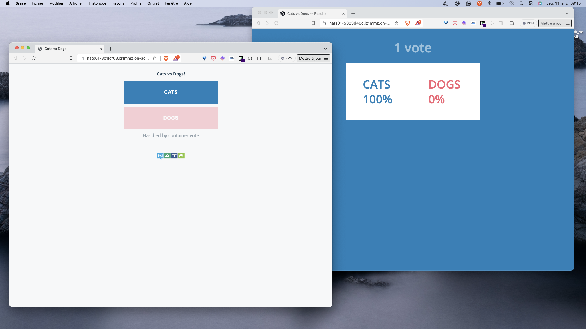

## What is NATS ?

NATS is a lightweight, high-performance messaging system for cloud-native applications, IoT messaging, and microservices architectures, known for its simplicity, scalability, and reliability.

## NATS as an Acorn Service

The Acornfile used to create a NATS based Acorn Service is available in the GitHub repository at [https://github.com/acorn-io/nats](https://github.com/acorn-io/nats). This service triggers the creation of a NATS message brocker running in a single container which can easily be used by an application during development.

This NATS instance generates a password for the admin user, allowed to publish and subscribe to any subjects (*>*)

The Acorn image of this service is hosted in GitHub container registry at [ghcr.io/acorn-io/nats](ghcr.io/acorn-io/nats)

## Usage

The [examples folder](https://github.com/acorn-io/nats/tree/main/examples) contains the Acornfile of the VotingApp microservice application modified in the way that is uses NATS pub/sub mechanism instead of Redis/Worker/Postgres to propagate votes from the Vote UI to the Result UI. The screenshot below shows both interfaces.



To use this Service, we first define a *service* property in the Acornfile of the application:

```
services: nats: {
	if args.dev {
		build: {
			context:   "../"
			acornfile: "../Acornfile"
		}
	} else {
		image: "ghcr.io/acorn-io/nats:v#.#.#-#"
	}
}
```

Note: the service is built first if in development mode

Next we define the application containers, both *vote* and *result* containers need to connect to NATS so we only give those ones the NATS_URL they need to use. Below is the definition of the *vote* container:

```
	vote: {
		image:  "registry.gitlab.com/voting-application/vote:v1.0.10"
		consumes: ["nats"]
		ports:  "5000/http"
		memory: 128Mi
		env: {
			BACKEND:        "nats"
			NATS_URL: "nats://@{service.nats.secrets.admin.username}:@{service.nats.secrets.admin.password}@nats:4222"
		}
	}
```

This example can be run with the following command (to be run from the *examples* folder)

```
acorn run -n vote -i
```

After a few tens of seconds the http endpoints will be returned allowing to access both vote and result web interfaces.

## About Acorn Sandbox

Instead of managing your own Acorn installation, you can deploy this application in the Acorn Sandbox, the free SaaS offering provided by Acorn. Access to the sandbox requires only a GitHub account, which is used for authentication.

[](https://acorn.io/run/ghcr.io/acorn-io/nats/examples:v%23.%23.%23-%23)

An application running in the Sandbox will automatically shut down after 2 hours, but you can use the Acorn Pro plan to remove the time limit and gain additional functionalities.